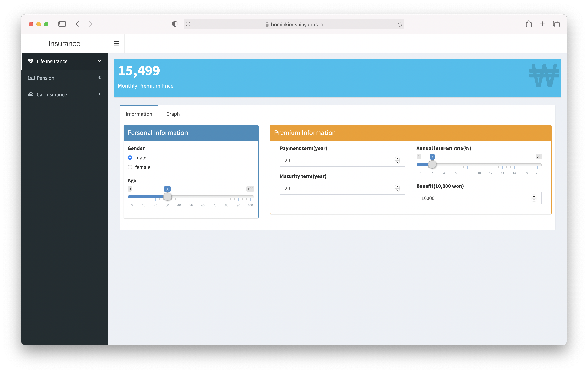
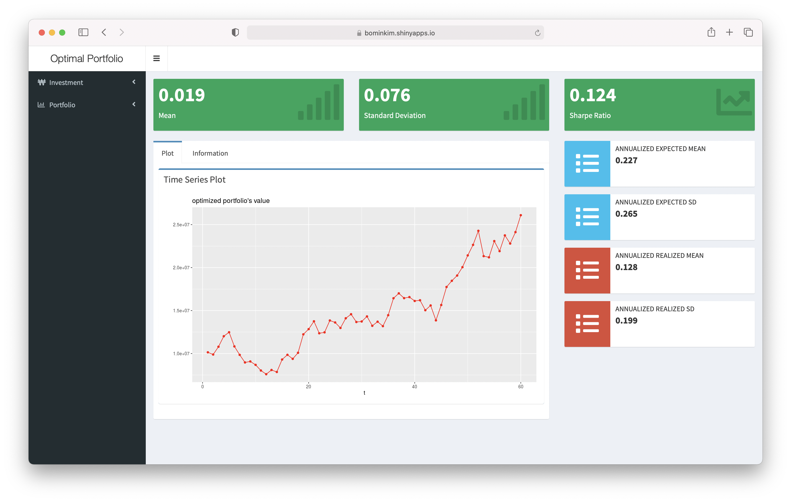

# R-Shiny-app

###### 1. [Demand Forecast in Movie](https://bominkim.shinyapps.io/movie/)

##### 2. [Calculate Premium](https://bominkim.shinyapps.io/insurance/)

#### 3. [Optimal Portfolio](https://bominkim.shinyapps.io/optimalportfolio/)


## How to make R shiny application
You can make R shiny app like so:
``` r
library(shiny)
library(shinydashboard)

ui <- dashboardPage(
  dashboardHeader(),
  dashboardSidebar(),
  dashboardBody()
)

server <- function(input, output) { }

shinyApp(ui, server)
```

You can deploy R shiny app like so:
``` r
rsconnect::deployApp()
```
